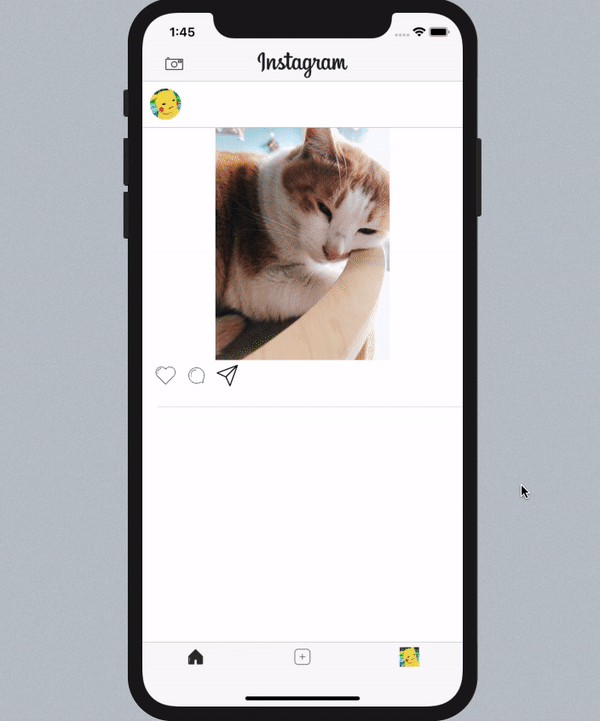

# Instagram Clone App 프로젝트

# Instagram에서 배운점
* ### `피드에 글이나 사진 게시하기 구현하기`
* ### `좋아요 구현하기`
* ### `댓글 구현하기`
* ### `SNS상의 복잡한 데이터 흐름 컨트롤하기`

---

# 좋아요를 누르고 댓글을 달 수 있습니다!

# 피드에 글이나 사진을 게시해서 공유할 수 있습니다1

